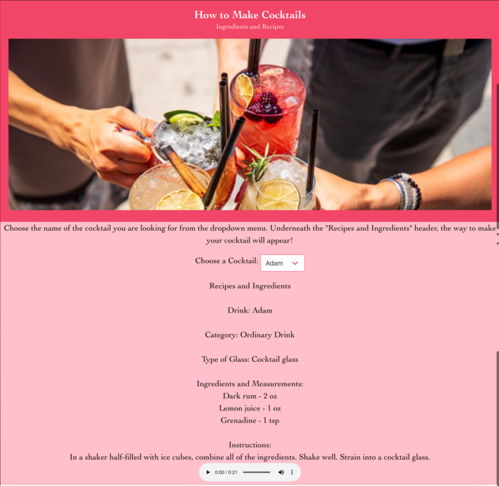

# Drink Text to Speech

The minimum viable product has a responsive design for users to choose their favorite drink that explains to them the ingredients they will need to use and read it out loud to them so they can make their drink without having to distract them from the task at hand. This website features 2 APIs, one that retrieves the drink ingredients and the other that reads it out loud. Then we have incorporated a responsive colorful css that allows the site to be very eye catching to the user. 
### Link to deployed repo

[Click me](https://spikey1289.github.io/drink_vtt_ICA/)
### Screenshot

